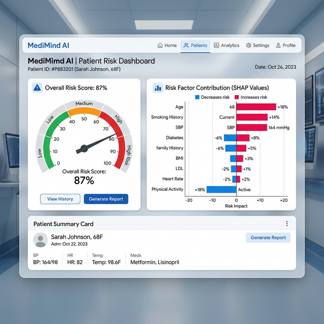

# An Integrated Explainable AI (XAI) Framework for Early Risk Assessment of Lifestyle-Induced NCDs via Multimodal Data Fusion

> **B.Tech Final Year Major Research Project**
> **Institution:** SRM Institute of Science and Technology (SRM IST)
> **Department:** Department of Computer Science & Engineering
> **Academic Year:** 2025-26

---

## 📑 Project Abstract

Non-Communicable Diseases (NCDs) account for **71% of global mortality** (WHO, 2023), with lifestyle factors being primary contributors. This research project presents a sophisticated **Clinical Decision Support System (CDSS)** designed to bridge the gap between high-accuracy machine learning and clinical interpretability.

By leveraging **Multimodal Data Fusion** of lifestyle behavioral patterns and clinical indicators from the CDC's BRFSS dataset, our framework provides early risk assessment for lifestyle-induced diseases. The system utilizes a **Soft Voting Ensemble** architecture and integrates **SHAP (SHapley Additive exPlanations)** to provide transparent, feature-level justifications for every prediction, ensuring the "black-box" nature of AI is replaced with actionable clinical insights.

---

## ✨ Key Research Contributions

### 1. Multimodal Data Integration
Fuses 21 critical health indicators (clinical + behavioral) from the **CDC BRFSS 2015 dataset** (253,680 respondents), enabling a holistic view of patient risk beyond just physiological markers.

### 2. Weighted Ensemble Architecture
Implemented a **Soft Voting Consensus** across three optimized base learners:
- **Logistic Regression** (Linear baseline)
- **Random Forest** (Non-linear complexity)
- **XGBoost** (Gradient-boosted decision trees)

### 3. Local Interpretability (XAI)
Integration of **SHAP TreeExplainer** to calculate feature contribution scores for individual patient assessments. This enables clinicians to see *exactly why* a patient is flagged as high risk.

### 4. Modular Microservices Design
The framework is architected for scalability, allowing the addition of new disease-specific modules (Cardiovascular, CKD, etc.) without modifying the core API gateway.

---

## 📊 Performance Metrics

The framework has been rigorously evaluated on a 20% holdout test set with the following results:

| Metric | Score | Description |
| :--- | :--- | :--- |
| **Accuracy** | **75.1%** | Overall correct predictions |
| **AUC-ROC** | **0.83** | Threshold-independent discriminative power |
| **Precision** | **0.75** | Positive predictive value (Weighted Average) |
| **Recall** | **0.75** | Sensitivity (Weighted Average) |
| **F1-Score** | **0.75** | Harmonic mean of Precision and Recall |

---

## 🏗️ System Architecture

The system is divided into five distinct layers:
1.  **Presentation Layer**: Built with Next.js 13 and Tailwind CSS for a clinical-grade, responsive dashboard.
2.  **API Gateway**: FastAPI-powered RESTful endpoints with Pydantic type validation.
3.  **ML Inference Engine**: Serves the trained Ensemble model via Joblib.
4.  **XAI Engine**: Computes SHAP values in real-time for prediction transparency.
5.  **Data Layer**: Manages the BRFSS feature store and model artifacts.

---

## 🛠️ Technology Stack

| Category | Technologies |
| :--- | :--- |
| **Backend** | Python 3.11, FastAPI, Scikit-learn, XGBoost, SHAP, Joblib |
| **Frontend** | React, Next.js, TypeScript, Tailwind CSS, Recharts, Lucide-React |
| **Data** | CDC BRFSS 2015 Dataset (253k+ records) |
| **DevOps** | Git, Vercel, Render/Supabase (Deployment) |

---

## 🚀 Getting Started

### Backend Setup
1. Navigate to the `backend/` directory.
2. Create a virtual environment: `python -m venv venv`
3. Activate the environment: `.\venv\Scripts\activate` (Windows)
4. Install dependencies: `pip install -r requirements.txt`
5. Start the server: `python main.py`
6. API will be available at: `http://localhost:8000/docs`

### Frontend Setup
1. Navigate to the `frontend/` directory.
2. Install dependencies: `npm install`
3. Run the development server: `npm run dev`
4. Access the dashboard at: `http://localhost:3000`

---

## 🗺️ Roadmap & Future Work

While the framework currently excels at **Type-2 Diabetes** assessment, our development roadmap for the final review includes:
- [x] Type-2 Diabetes Module (Active/Validation)
- [ ] Cardiovascular Disease Risk Module (In-Progress)
- [ ] Hypertension Prediction Module (Planned)
- [ ] Chronic Kidney Disease (CKD) Module (Planned)
- [ ] Stroke Risk Assessment (Planned)
- [ ] Real-time patient recommendation engine based on SHAP insights.
- [ ] Improving model performance to **85%+ accuracy** for the final review.

---

## 👥 The Research Team

- **Vimal M** - [LinkedIn](https://www.linkedin.com/) | [GitHub](https://github.com/)
- **Alfred Ferdinand** - [LinkedIn](https://www.linkedin.com/) | [GitHub](https://github.com/)

**Guided by:** Department of Computer Science & Engineering, SRM IST.

---

## ⚖️ License
This project is for academic research as part of the B.Tech program at SRM Institute of Science and Technology. All rights reserved.

---
*Aligned with UN Sustainable Development Goal 3: Ensure healthy lives and promote well-being for all at all ages.*
